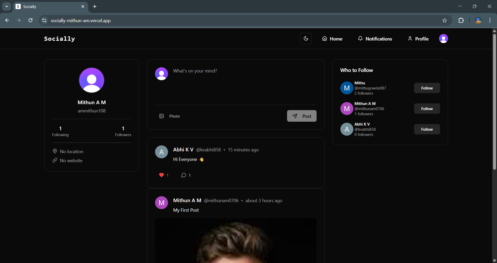

<h1 align="center">Socially</h1>

Socially is a social media web application built with **Next.js**, **Clerk for authentication**, and **Prisma**.  
Users can create posts, like/unlike posts, follow/unfollow other users, and customize their profiles.

---

### Home Page Screenshot

---
###  Live Demo
[https://socially-mithun-am.vercel.app/](https://socially-mithun-am.vercel.app/)

---
### Features

- **User Authentication** with [Clerk](https://clerk.com/).
- **Profile Pages** with posts, likes, followers, and following tabs.
- **Follow/Unfollow** functionality.
- **Edit Profile** with bio, location, and website updates.
- **Post Management** – create, view, and like posts.
- **Responsive UI** (Desktop & Mobile Navigation).
- **Dark/Light Mode** toggle with `next-themes`.
- **Modern UI Components** with [ShadCN UI](https://ui.shadcn.com/) and **TailwindCSS**.

---

### Tech Stack

- **Frontend**: [Next.js 14](https://nextjs.org/) (App Router + Server Actions)
- **Authentication**: [Clerk](https://clerk.com/).
- **Database**: [Prisma ORM](https://www.prisma.io/) with PostgreSQL.
- **UI**: [ShadCN UI](https://ui.shadcn.com/), [TailwindCSS](https://tailwindcss.com/).
- **Icons**: [Lucide React](https://lucide.dev/).
- **Utilities**: [date-fns](https://date-fns.org/), [react-hot-toast](https://react-hot-toast.com/).

---

### .env
- DATABASE_URL=
- NEXT_PUBLIC_CLERK_PUBLISHABLE_KEY==
- CLERK_SECRET_KEY=
- UPLOADTHING_TOKEN=